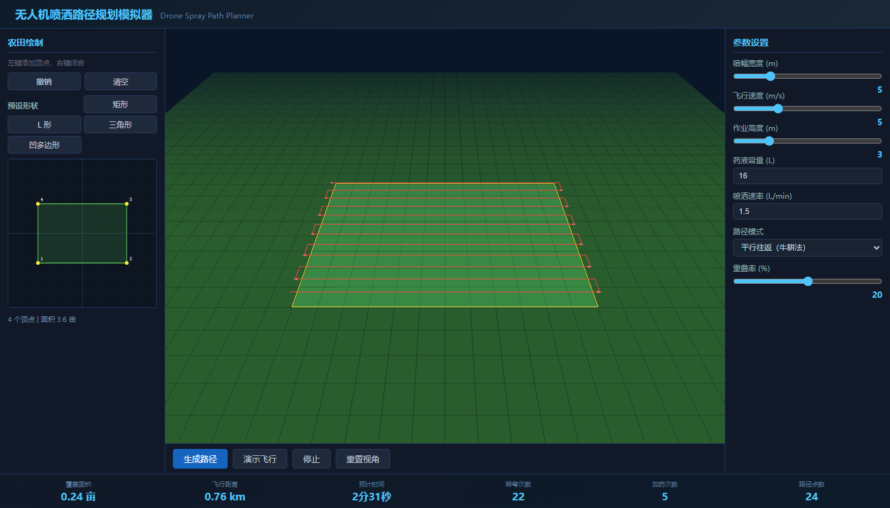

# 无人机喷洒路径规划模拟器

纯前端交互式农业无人机航线规划工具，支持农田多边形绘制、牛耕法路径生成、3D飞行动画演示。

## 在线演示
https://awtx550w.github.io/drone-spray-planner/

## 功能特性

- **农田绘制**: Canvas 2D 交互式多边形绘制，支持矩形/L形/三角形/凹多边形预设
- **路径规划**: 凸包分解 + 牛耕法覆盖算法，支持重叠率、喷幅宽度调节
- **3D 可视化**: Three.js 渲染农田地形、飞行路径、无人机模型
- **飞行动画**: 无人机沿路径飞行，带喷洒粒子效果
- **作业统计**: 覆盖面积、飞行距离、预计时间、转弯次数、加药次数

## 技术栈

- HTML5 Canvas + CSS3
- Three.js r128 (CDN)
- 纯 JavaScript，零构建依赖

## 算法说明

### 凸包分解
将凹多边形分解为多个凸子区域，使用耳切法检测凹顶点并切割。

### 牛耕法 (Boustrophedon Decomposition)
在每个凸子区域内，按喷幅宽度生成平行往返路径，确保全覆盖无遗漏。

### 路径优化
- 边界内缩：避免边缘漏喷
- 转弯平滑：端点处插入圆弧过渡
- 区域连接：贪心最近邻连接多区域路径

## 本地运行

```bash
cd drone-spray-planner
python -m http.server 8080
# 打开 http://localhost:8080
```

## 截图



## License

MIT
